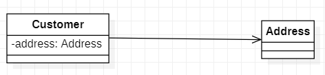
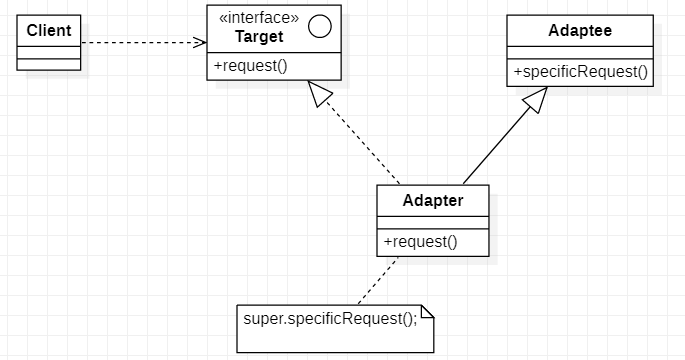
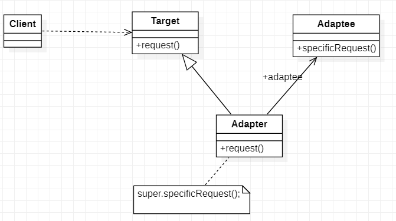

# demo-design-patterns
个人实现设计模式，使用java语言


# 一、面向对象的设计原则

1. ## **单一职责原则**

*一个对象应该只包含单一的职责，并且该职责被完美的封装在一个类中。*

 

每一个职责都是变化的一个轴线，如果一个类有一个以上的职责，这些职责就耦合在了一起。这会导致脆弱的设计。当一个职责发生变化时，可能会影响其它的职责。另外，多个职责耦合在一起，会影响复用性。单一职责原则不只是面向对象编程思想所特有的，只要是模块化的程序设计，都需要遵循这一重要原则。

 

## *2.* **里氏替换原则**

*所有引用基类（父类）的地方必须能透明地使用其子类的对象。*

 

子类可以实现父类的抽象方法，子类也中可以增加自己特有的方法，但不能覆盖父类的非抽象方法。当子类的方法重载父类的方法时，方法的前置条件（即方法的形参）要比父类方法的输入参数更宽松。当子类的方法实现父类的抽象方法时，方法的后置条件（即方法的返回值）要比父类更严格。Java多态基于该原则设计。

 

## *3.* **依赖倒置原则**

*高层模块不应该从低层模块导入任何东西，两者都应该依赖于抽象。抽象不应该依赖于细节，细节应当依赖于抽象*。 

 

采用依赖倒置原则尤其给多人合作开发带来了极大的便利，参与协作开发的人越多、项目越庞大，采用依赖导致原则的意义就越重大。依赖倒置原则就是要面向接口编程，理解了面向接口编程，也就理解了依赖倒置。Java多态基于该原则设计。

 

 

## *4.* **接口隔离原则**

*客户端不应该依赖哪些它不需要的接口。*

 

我们在代码编写过程中，运用接口隔离原则，一定要适度，接口设计的过大或过小都不好。对接口进行细化可以提高程序设计灵活性是不挣的事实，但是如果过小，则会造成接口数量过多，使设计复杂化。所以一定要适度。设计接口的时候，只有多花些时间去思考和筹划，就能准确地实践这一原则。Java多接口继承依赖该原则。

 

## *5.* **迪米特法则**

*每一个软件单位对其他单位尽可能少的了解，而且局限于哪些与本单位密切相关的的软件。* 

 

迪米特法则的初衷是降低类之间的耦合，由于每个类都减少了不必要的依赖，因此的确可以降低耦合关系。但是凡事都有度，虽然可以避免与非直接的类通信，但是要通信，必然会通过一个“中介”来发生联系。故过分的使用迪米特原则，会产生大量这样的中介和传递类，导致系统复杂度变大。所以在采用迪米特法则时要反复权衡，既做到结构清晰，又要高内聚低耦合。

 

## *6.* **开闭原则**

*软件实体应对扩展开放，而对修改关闭*


开闭原则具有理想主义的色彩，说的很抽象，它是面向对象设计的终极目标。其他几条原则，则可以看做是开闭原则的实现。我们要用抽象构建框架，用实现扩展细节。

 

## *7.* **组合/聚合复用原则**

*优先使用对象的组合，而不是使用继承来达到复用的目的*

 

组合/聚合复用原则可以使系统更加灵活，类与类之间的耦合度降低，一个类的变化对其他类造成的影响相对较少，因此一般首选使用组合/聚合来实现复用；其次才考虑继承，在使用继承时，需要严格遵循里氏代换原则，有效使用继承会有助于对问题的理解，降低复杂度，而滥用继承反而会增加系统构建和维护的难度以及系统的复杂度，因此需要慎重使用继承复用。

 

 

综上所述，设计模式是一种标准化的解决方案，可以帮助我们解决一些特定的设计问题，提高软件的质量和可维护性。面向对象设计思想是一种基于对象的软件设计方法，它将现实世界中的问题抽象成为一个个对象，并将对象之间的交互作为解决问题的基本方式，包括封装、继承、多态、抽象和接口等概念。通过学习和运用设计模式和面向对象设计思想，可以提高软件的设计水平，提高代码的可读性、可维护性和可扩展性，从而更好地满足用户的需求。


# 二、UML

## 1.概述

**统一建模语言**（英语：*Unified Modeling Language*，缩写**UML**）是非专利的第三代建模和规约语言。

UML是一种开放的方法，用于说明、可视化、构建和编写一个正在开发的、面向对象的、软件密集系统

的制品的开放方法。UML展现了一系列最佳工程实践，这些最佳实践在对大规模，复杂系统进行建模方

面，特别是在软件架构层次已经被验证有效。

## 2.UML图

> 类图是一切面向对象方法的核心建模工具。该图描述了系统中对象的类型以及它们之间存在的各种静态
>
> 关系。

例如：

对应的代码：

```java
/**
 * @author SuanLa
 * @project java-design-patterns
 * @Date 2023/5/23 17:21
 */
public class Demo {
    private String variable;

    public void method(String var){}
}
```

## 3.类之间的关系

### 3.1关联关系

> 关联（Association）关系是一种结构化的关系，用于表示一个类对象与另一个类对象的之间的关系，在
>
> 代码中被关联的对象以成员变量的方式体现。


#### 3.1.1双向关联

> 不带箭头就是双向关联，如下图所示


#### 3.1.2单向关联

> 下面是一个单向关联的UML表示方式



#### 3.3.3自关联

> 类的属性对象包含自己的情况，如下图所示


#### 3.3.4多重性关联

多重性关联关系又称为重数性（Multiplicity）关联关系，表示关联对象之间存在数量关系。

- 数量关系符表示如下

- 1或1..1：表示另一个类的一个对象只与该类的一个对象有关系

- 0..*：表示另一个类的一个对象与该类的零个或多个对象有关系

- 1..*：表示另一个类的一个对象与该类的一个或多个对象有关系

- 0..1：表示另一个类的一个对象没有或只与该类的一个对象有关系

- m..n：表示另一个类的一个对象与该类最少m最多n个对象有关系（m ≤ n）


### 3.2聚合关系

> 聚合（Aggregation）关系表示整体与部分的关系，在聚合中成员是整体对象的一部分，成员对象可以
>
> 脱了整体对象而独立存在。
>
> 

### 3.3组合关系

> 组合（Composition）关系也表示整体与部分的关系，在组合中整体对象可以控制成员对象的生命周
>
> 期，一旦整体对象消亡成员对象将消失。


### 3.4依赖关系

> 依赖（Dependency）关系是一种使用关系，在大多数情况下依赖关系体现在某个类方法参数上使用另
>
> 一个类的对象作为方法参数。


### 3.5泛化关系

> 泛化（Generalization）关系也就是继承关系。


### 3.6接口与实现关系

> 接口（Interface）之间也可以有与类之间关系类似的继承关系和依赖关系，接口与类之间同时还存在一
>
> 种实现（Realization）关系，在这种关系中类实现了接口中所有的操作。


# 三、简单工厂模式

## 1.模式定义

> 简单工厂模式（**Simple Factory Pattern**）又叫做静态工厂方法模式（**Static Factory Method**

> **Pattern**），并不属于 GoF 的23种设计模式之一，是学习其他工厂模式的的基础。

其定义如下：

*Wikipedia says：Factory is an object for creating other objects – formally a factory is a function*

*or method that returns objects of a varying prototype or class.*

*工厂是一个用于创建其他对象的对象——从形式上讲，工厂是一个函数或方法，它返回不同原型*

*或类型的对象。*

*Providing a static method encapsulated in a class called the factory, to hide the*

*implementation logic and make client code focus on usage rather than initializing new*

*objects.*

*提供封装在名为工厂的类中的静态方法，以隐藏实现逻辑并使客户端代码专注于使用而不是初始*

*化新对象。*

## 2.模式结构


在简单工厂模式结构图中包含如下几个角色：

- **Factory（工厂角色）**：工厂角色即工厂类，它是简单工厂模式的核心，负责实现创建所有产品实

例的内部逻辑；工厂类可以被外界直接调用，创建所需的产品对象；在工厂类中提供了静态的工厂

方法 factoryMethod() ，它的返回类型为抽象产品类型Product。

- **Product（抽象产品角色）**：它是工厂类所创建的所有对象的父类，封装了各种产品对象的公有方

法，它的引入将提高系统的灵活性，使得在工厂类中只需定义一个通用的工厂方法，因为所有创建

的具体产品对象都是其子类对象。

- **ConcreteProduct （具体产品角色）**：它是简单工厂模式的创建目标，所有被创建的对象都充当

这个角色的某个具体类的实例。每一个具体产品角色都继承了抽象产品角色，需要实现在抽象产品中声明的抽象方法。

## 3.模式应用

1.在某OA系统中，系统根据对比用户在登陆时输入的帐号和密码以及在数据库中存储的账号和密码是否一致进行身份验证，如果验证通过，则去除存储在数据库中的用户权限等级（以整形存储），根据不同的权限等级创建不同等级的用户对象，不同等级的用户对象拥有不同的操作权限。先使用简单工厂模式来设计该权限管理模块。

# 四、工厂方法模式

## 1.模式定义

> 工厂方法模式也被称为虚拟构造器模式（**Virtual Constructor Pattern**）或多态工厂模式

> （**Polymorphic Factory Pattern**）。

其定义如下：

*Define an interface for creating an object, but let subclasses decide which class to*

*instantiate. Factory Method lets a class defer instantiation to subclasses.*

*定义一个用于创建对象的接口，让子类决定将哪一个类实例化。工厂方法模式让一个类的实例化*

*延迟到其子类。*

在工厂方法模式中，**不再提供一个统一的工厂类来创建所有的产品对象，而是针对不同的产品提供不同**

**的工厂，系统提供一个与产品等级结构对应的工厂等级结构**。

## 2.模式结构


在工厂方法模式结构图中包含如下几个角色：

**Product（抽象产品）**：它是定义产品的接口，是工厂方法模式所创建对象的超类型，也就是产品对象

的公共父类。

**ConcreteProduct（具体产品）**：它实现了抽象产品接口，某种类型的具体产品由专门的具体工厂创

建，具体工厂和具体产品之间一一对应。

**Factory（抽象工厂）**：在抽象工厂类中，声明了工厂方法(Factory Method)，用于返回一个产品。抽

象工厂是工厂方法模式的核心，所有创建对象的工厂类都必须实现该接口。

**ConcreteFactory（具体工厂）**：它是抽象工厂类的子类，实现了抽象工厂中定义的工厂方法，并可由

客户端调用，返回一个具体产品类的实例。

## 3.模式应用

1. 宝马（BMW）工厂制造宝马汽车，奔驰（）工厂制造奔驰汽车。使用工厂方法模式模拟该场景。

# 五、抽象工厂模式

## 1.模式定义

> 工厂方法模式通过引入工厂等级结构，解决了简单工厂模式中工厂类职责太重的问题，但由于工厂方法
>
> 模式中的**每个工厂只生产一类产品**，可能会导致系统中存在大量的工厂类，势必会增加系统的开销。此
>
> 时，我们可以考虑将一些相关的产品组成一个“产品族”，由同一个工厂来统一生产，这就是抽象工厂模
>
> 式（**Abstract Factory Pattern**）的基本思想。

其定义如下：

*Wikipedia says: The abstract factory pattern provides a way to encapsulate a group of individual*

*factories that have a common theme without specifying their concrete classes.*

*抽象工厂模式提供了一种方法来封装一组具有共同主题的单个工厂，而无需指定其具体类。*

*Provide an interface for creating families of related or dependent objects without specifying their*

*concrete classes.*

*提供一个创建一系列相关或相互依赖对象的接口，而无须指定它们具体的类。*

**抽象工厂模式是所有形式的工厂模式中最为抽象和最具一般性的一种形式。**

当一个工厂等级结构可以创建出分属于不同产品等级结构的一个产品族中的所有对象时，抽象工厂模式

比工厂方法模式更为简单、更有效率。

## 2.模式结构


在抽象工厂模式结构图中包含如下几个角色：

**AbstractFactory（抽象工厂）**：它声明了一组用于创建一组产品的方法，每一个方法对应一种产品。

**ConcreteFactory（具体工厂）**：它实现了在抽象工厂中声明的创建产品的方法，生成一组具体产品，

这些产品构成了一个产品族，每一个产品都位于某个产品等级结构中。

**AbstractProduct（抽象产品）**：它为每种产品声明接口，在抽象产品中声明了产品所具有的业务方

法。

**ConcreteProduct（具体产品）**：它定义具体工厂生产的具体产品对象，实现抽象产品接口中声明的

业务方法。

## 3.模式应用

1.某系统为了改进数据库操作性能，自定义数据库连接对象Connection和语句对象Statement，可针对不同类型的数据库提供不同不同的连接对象和语句对象，如提供Oracle或MySQL，专用连接和语句类，而且用户可以通过配置文件等方式根据实际需要动态更换系统数据库。使用抽象工厂模式设计该系统。


# 六、单例模式

## 1.模式定义

> 对于一个软件系统的某些类而言，我们无须创建多个实例。为了节约系统资源，有时需要确保系统中某
>
> 个类只有唯一一个实例，当这个唯一实例创建成功之后，我们无法再创建一个同类型的其他对象，所有
>
> 的操作都只能基于这个唯一实例。为了确保对象的唯一性，我们可以通过单例模式（**Singleton**
>
> **Pattern**）来实现，这就是单例模式的动机所在。单例模式又名单件模式或单态模式。

其定义如下：

*Wikipedia says: In software engineering, the singleton pattern is a software design pattern that*

*restricts the instantiation of a class to one object. This is useful when exactly one object is needed*

*to coordinate actions across the system.*

*在软件工程中，单例模式是一种软件设计模式，它将类的实例化限制为一个对象。当需要一个对*

*象来协调整个系统的操作时，这很有用。*

*Ensure a class only has one instance, and provide a global point of access to it.*

*确保某一个类只有一个实例，并提供一个全局的访问点来访问这个实例。*

## 2.模式结构


单例模式结构图中只包含一个单例角色：

**Singleton（单例）**：在单例类的内部实现只生成一个实例，同时它提供一个静态的 getInstance ()工

厂方法，让客户可以访问它的唯一实例；为了防止在外部对其实例化，将其构造函数设计为私有；在单

例类内部定义了一个Singleton类型的静态对象，作为外部共享的唯一实例。

## 3.模式应用

1.使用单例模式的思想实现多里摩士，确保系统中某个类的对象只能存在有限个，如两个或三个。设计并编码，实现一个多例类。

# 七、建造者模式

## 1.模式定义

> 建造者模式（Builder Parttern），将一个复杂对象的构建与它的表示分离，使得同样的构建过程可以创建不同的表示。建造者模式是一步一步创建一个复杂的对象，它允许用户只通过指定复杂对象的类型和内容就可以构建他们，用户不需要知道内部的具体构建细节。建造者模式又可以称为生成器模式。

建造者模式（Builder Pattern）定义如下：

*Wikipedia says: The builder pattern is an object creation software design pattern with the*

*intentions of finding a solution to the telescoping constructor anti-pattern.*

*建造者模式是一种对象创建软件设计模式，旨在找到伸缩构造器反模式的解决方案。*

*伸缩性构造的反模式：指通过构造器实现对象构建参数初始化，如果对象属性比较多，导致构造*

*器的参数个数不可控。*

*Separate the construction of a complex object from its representation so that the same*

*construction process can create different representations.*

*将一个复杂对象的构建与它的表示分离，使得同样的构建过程可以创建不同的表示。*

## 2.模式结构


在建造者模式结构图中包含如下几个角色：

**Builder（抽象建造者）**：它为创建一个产品Product对象的各个部件指定抽象接口，在该接口中

一般声明两类方法，一类方法是 buildPartXXXX ()，它们用于创建复杂对象的各个部件；另一类

方法是build()，它们用于返回复杂对象。Builder既可以是抽象类，也可以是接口。

**ConcreteBuilder （具体建造者）**：它实现了Builder接口，实现各个部件的具体构造和装配方

法，定义并明确它所创建的复杂对象，也可以提供一个方法返回创建好的复杂产品对象。

**Product（产品角色）**：它是被构建的复杂对象，包含多个组成部件，具体建造者创建该产品的内

部表示并定义它的装配过程。

**Director（指挥者）**：指挥者又称为导演类，它负责安排复杂对象的建造次序，指挥者与抽象建

造者之间存在关联关系，可以在其construct()建造方法中调用建造者对象的部件构造与装配方法，

完成复杂对象的建造。客户端一般只需要与指挥者进行交互，在客户端确定具体建造者的类型，并

实例化具体建造者对象（也可以通过配置文件和反射机制），然后通过指挥者类的构造函数或者

Setter方法将该对象传入指挥者类中。

## 3.模式应用

1.计算机组装工厂可以将CPU、内存、硬盘、主机、显示器等硬件设备组装在一起构成一台完整的计算机，且构成的计算机可以是笔记本电脑，也可以是台式机，还可以使不提供显示器的服务器主机。对于用户而言，无须关系计算机的组成设备和组装过程，工厂返回给用户的是完整的计算机对象。使用建造者模式实现计算机组装过程。

# 八、适配器模式

## 1.模式定义

> 适配器模式（**Adapter Pattern**），将一个接口转换成客户希望的另一个接口，适配器模式使接口不兼容的那些类可以一起工作，其别名为包装器。适配器模式既可以作为类结构型模式，也可以作为对象结构型模式。适配器模式也叫包装器（**Wrapper**）模式。

适配器模式定义如下：

*Wikipedia says: In software engineering, the adapter pattern is a software design pattern that*

*allows the interface of an existing class to be used as another interface. It is often used to make*

*existing classes work with others without modifying their source code.*

*在软件工程中，适配器模式是一种软件设计模式，它允许将现有类的接口用作另一个接口。它通*

*常用于使现有类与其他类一起工作，而无需修改其源代码。*

*Convert the interface of a class into another interface the clients expect. Adapter lets classes work*

*together that couldn't otherwise because of incompatible interfaces.*

*将类的接口转换为客户端期望的另一个接口。适配器让那些接口不兼容的类可以一起工作。*

***TIP**：在适配器模式定义中所提及的接口是指广义的接口，它可以表示一个方法或者方法的集合*

## 2.模式结构

### 2.1 类适配器模式



在对象适配器模式结构图中包含如下几个角色：

**Target（目标抽象类）**：目标抽象类定义客户所需接口，可以是一个抽象类或接口，也可以是具

体类。

**Adapter（适配器类）**：适配器可以调用另一个接口，作为一个转换器，对 Adaptee 和Target进

行适配，适配器类是适配器模式的核心，在对象适配器中，它通过继承Target并关联一个Adaptee 对象使二者产生联系。

**Adaptee （适配者类）**：适配者即被适配的角色，它定义了一个已经存在的接口，这个接口需要

适配，适配者类一般是一个具体类，包含了客户希望使用的业务方法，在某些情况下可能没有适配

者类的源代码。

### 2.2 对象适配器



在类适配器模式结构图中包含如下几个角色：

**Target（目标抽象类）**：目标抽象类定义客户所需接口，由于Java不支持多继承，所以Target只能

是接口类型。

**Adapter（适配器类）**：适配器可以调用另一个接口，作为一个转换器，对 Adaptee 和Target进

行适配，适配器类是适配器模式的核心，在类适配器中，它通过实现Target接口和继承 Adaptee

类来使二者产生联系。

**Adaptee （适配者类）**：适配者即被适配的角色，它定义了一个已经存在的接口，这个接口需要

适配，适配者类一般是一个具体类，包含了客户希望使用的业务方法，在某些情况下可能没有适配

者类的源代码。

## 3.模式应用

1.实现一个双向适配器实例，使得猫可以学狗叫，狗可以学猫抓老鼠。


# 九、组合模式


# 十、外观模式


# 十一、代理模式


# 十二、迭代器模式


# 十三、观察者模式


# 十四、装饰器模式


# 十五、模板方法模式

